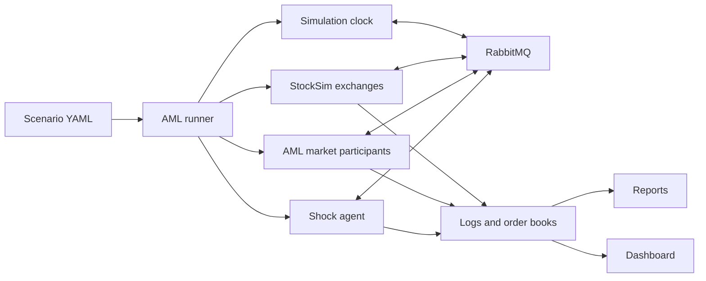

# AML-Sim

AML-Sim is a laboratory for synthetic financial markets. It brings together
different market participants, realistic order books, controlled shocks, and
optional LLM-based strategy updates so researchers can study how markets react
when conditions change.

It is built on [StockSim](https://github.com/shmaiii/StockSim). StockSim handles
the exchange, matching engine, simulation clock, messaging, and portfolio
accounting. AML-Sim adds the participant roles, shocks, market relationships,
experiment controls, reporting, and dashboard.

> AML-Sim is an experimental research platform. Its simulated prices are not
> live market data, forecasts, or trading recommendations.

## What it can do

- Run synthetic single-market and multi-market simulations.
- Build multi-level limit order books and generate prices from agent trading.
- Simulate market makers, retail traders, institutional traders, informed
  traders, liquidity takers, cross-market arbitrageurs, and shock agents.
- Give trading agents a fast action loop and either a frozen or OpenAI-backed
  slow strategy loop.
- Introduce scheduled, announced, or seeded random micro and macro shocks.
- Connect markets through information, valuation, and arbitrage channels.
- Track orders, fills, positions, exposure, portfolio value, PnL, and strategy
  changes by agent.
- Compare treatments across repeatable random seeds.
- Watch markets live and open completed runs in the React dashboard.
- Add supported participant roles through the dashboard's Agent Studio.

The current research scenarios cover stocks, futures, and bonds. The
relationship framework can be extended to options and ETFs, but not every
asset-specific pricing and hedging mechanism is implemented yet.

## How it fits together



Every instrument has its own exchange process, and every configured agent runs
in a separate process. RabbitMQ carries clock ticks, market observations,
orders, fills, and shock information between them.

## Agent decision model

Trading agents use two connected loops:

- The **fast loop** runs frequently and turns the current strategy into orders.
- The **slow loop** reviews prices, the order book, inventory, fills, memory,
  market state, and shocks, then proposes a bounded strategy update.

The slow loop can be:

- `frozen`, for deterministic controls and repeatable experiments; or
- `openai`, for adaptive LLM-assisted decisions.

The LLM never places orders directly. Its proposal is validated before the
role-specific fast loop can use it. If an API call fails or the response is
invalid, the agent keeps its last valid strategy and records the failure.

## Project layout

```text
AML-Sim/
├── aml_runner.py                 # Headless scenario runner
├── dashboard_server.py           # Local dashboard and API server
├── aml_sim/                      # AML orchestration and behavior
│   ├── agents/                   # Participant roles and fast/slow loops
│   └── ecology/                  # Relationships, seeds, and research reports
├── scenarios/                    # General and research scenarios
├── analysis/                     # Research analysis scripts
├── dashboard/                    # React/Vite frontend
├── docs/                         # User, developer, and research guides
├── tests/                        # AML tests
└── simulators/StockSim/          # StockSim engine submodule
```

For more detail, see:

- [User guide](docs/USER_GUIDE.md)
- [Developer guide](docs/DEVELOPER_GUIDE.md)
- [Financial ecology architecture](docs/research/financial_ecology_architecture.md)
- [Server capacity report](docs/SERVER_CAPACITY_REPORT.md)

## Setup

### 1. Prepare the repository

```bash
git submodule update --init --recursive
python3 -m venv .venv
source .venv/bin/activate
python -m pip install --upgrade pip
python -m pip install -r requirements.txt
```

### 2. Start RabbitMQ

RabbitMQ must be available at `localhost:5672` unless the scenario uses another
host.

With Homebrew on macOS:

```bash
brew services start rabbitmq
```

Or with Docker:

```bash
cd simulators/StockSim
docker compose up -d rabbitmq
cd ../..
```

### 3. Configure OpenAI only when needed

Frozen scenarios do not need an API key. For OpenAI-backed slow loops, create a
private `.env` file in the AML-Sim root:

```text
OPENAI_API_KEY=your_api_key
```

Never place an API key in source code, scenario YAML, reports, or shared files.

## Run a simulation

Check a scenario without starting its processes:

```bash
python aml_runner.py scenarios/aml_orderbook_replay.yaml --dry-run
```

Run it and generate reports:

```bash
python aml_runner.py scenarios/aml_orderbook_replay.yaml \
  --run-id local_smoke \
  --reports
```

Run IDs identify the output folder under `.aml_runs/`. They must be unique.
When no ID is provided, AML-Sim creates a timestamped one.

For a compact stock/future simulation with LLM agents and random shocks:

```bash
python aml_runner.py scenarios/research/stock_future_llm_random_shocks.yaml \
  --run-id stock_future_llm \
  --reports
```

## Use the dashboard

Build the frontend after cloning or changing dashboard code:

```bash
cd dashboard
npm ci
npm run build
cd ..
```

Start the local server:

```bash
python dashboard_server.py --port 8766
```

Open [http://127.0.0.1:8766](http://127.0.0.1:8766).

From the dashboard you can:

- select and launch a scenario;
- choose a run ID;
- add supported participant groups and adjust their parameters;
- watch prices, order books, trades, shocks, and agent activity;
- switch between instruments in a multi-market run;
- inspect LLM status and strategy changes; and
- reopen completed runs and their reports.

The dashboard is a trusted local tool. It has no authentication and should not
be exposed directly to the public internet.

## Reproducible research runs

Ecology scenarios support paired seeds, strategist selection, and calibrated
arbitrage thresholds:

```bash
python aml_runner.py \
  scenarios/research/financial_ecology_stock_future_foundation.yaml \
  --run-id ecology_a1_r1 \
  --master-seed 20261001 \
  --replicate-id 1 \
  --arbitrage-entry-bps 10 \
  --arbitrage-exit-bps 3 \
  --slow-strategist frozen \
  --reports
```

Use `--slow-strategist openai` for an adaptive treatment. The override applies
to trading participants, not the shock agent.

## Run outputs

Each run is archived under `.aml_runs/<run-id>/`:

```text
.aml_runs/<run-id>/
├── scenario.yaml
├── stocksim_config.yaml
├── metadata.json
├── logs/
├── decision_context/
├── charts/
└── reports/
```

Reports include market paths, order and fill activity, agent portfolios,
strategy changes, shock delivery, relationship decisions, and experiment seed
metadata. The exact files depend on whether the scenario enables ecology and
OpenAI features.

## Tests

Run the AML test suite:

```bash
source .venv/bin/activate
python -m unittest discover -s tests -p 'test_*.py'
```

Check the dashboard build:

```bash
cd dashboard
npm run build
```

## Current boundaries

- Runs are finite and controlled by the scenario clock.
- A simulated hour with 30-second ticks usually takes about ten real minutes,
  plus startup, LLM, and reporting time.
- Multi-leg orders can fill unevenly because execution is not atomic.
- Thin synthetic books can amplify feedback between agents and prices.
- Large agent populations need a longer RabbitMQ startup grace.
- The system is designed for experiments, not live trading or production order
  routing.
