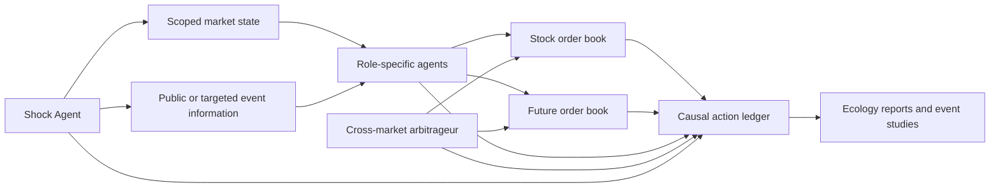

# Financial Market Ecology Foundation

## Purpose

AML's financial-ecology extension is for controlled, causal experiments. It
does not attempt to reconstruct historical prices. A scenario declares which
markets are connected, which shocks arrive, what each agent can observe, and
which transmission channels are active. Holding those inputs and component
seeds fixed lets us attribute differences in outcomes to an intervention.

The first implemented pair is a stock and its future. Stocks, options, ETFs,
bonds, and rate futures use the same graph contract, but each new pair should
be added only after it passes the validation gates below.

## Architecture

StockSim still owns exchange matching, order books, fills, cash, positions,
and mark-to-market accounting. AML owns scenario semantics, agent roles,
shock state, relationship contracts, deterministic seeds, and research
reporting.

## State and Information

Economic exposure and information visibility are separate:

- **Global state**: policy rate, funding spread, broad risk aversion, and
  system liquidity. A declared macro event can move every market directly.
- **Market state**: one asset-class or venue's liquidity and risk conditions.
- **Instrument state**: firm value, local order flow, sentiment, and
  idiosyncratic liquidity. A micro shock changes only named instruments.

All agents may receive public event information. That alone does not give an
unexposed instrument a direct shock pressure. The state and direct effects are
filtered by instrument; a later reaction can still transmit through an enabled
relationship agent.

## Relationship Graph

Each edge declares `source`, `target`, `type`, `channels`, and `parameters`.
There are no hidden ticker-name rules.

| Edge type | Reference relation | First specialist |
| --- | --- | --- |
| `spot_future` | cost of carry and basis | basis arbitrageur |
| `underlying_option` | delta/volatility/parity | option dealer and delta hedger |
| `basket_etf` | basket NAV/premium | authorized participant |
| `bond_rate_future` | duration/yield hedge | relative-value fund |

The current foundation implements `spot_future` reference pricing and a
bounded two-leg basis-arbitrageur. Other edge types are validated graph types,
not yet trading mechanisms.

## Channels and Treatments

Channels are configured per edge:

- `information`: for a local-visibility event, agents in the linked market
  receive an information-only copy with the relationship ID. It carries no
  direct state or price effect; LLM slow loops can condition on it.
- `valuation`: the edge provides a reference value such as cost of carry.
- `arbitrage`: the cross-market participant may submit hedged two-leg orders.
- `shared_risk`: reserved for later shared funding, margin, and capital
  constraints.

The implemented initial treatments are D0 disconnected, I1 information-only,
and A1 arbitrage, all with the same master seed and replicate ID. Use
`visibility: affected` on a local event for I1: the source market receives the
event directly while linked-market agents receive its information-only copy.
`shared_risk` and the eventual full-ecology treatment remain explicitly out of
scope until shared funding, margin, and capital constraints are implemented.

## Reproducibility and Reporting

One master seed produces independent streams for each actual agent process:

`(master_seed, replicate_id, agent_type, agent_id, purpose)`

The run metadata records the scenario hash, treatment, relationship graph, and
seed plan. Repeated agents no longer share a configured random seed. The
ecology reporter writes:

- `ecology_manifest.json`: treatment, seed, and normalized relationship graph;
- `ecology_market_summary.json`: deduplicated per-instrument trade paths and
  observed shocks;
- `ecology_channel_ledger.json`: relationship observations, decisions, orders,
  fills, and the shock IDs that were active when they occurred.
- `ecology_decision_summary.json`: per-decision leg requests, fills, and a
  `fully_hedged`, `partial_or_unhedged`, `unfilled`, or `observed_only` outcome.

Each cross-market order carries a decision ID, relationship ID, source and
target instruments, leg, channel, observed basis, and active event IDs.

## Validation Gates

Before interpreting an experiment:

1. A micro shock must have zero direct state/effect in an unexposed market.
2. A no-op slow loop must leave the scenario's strategy parameters unchanged.
3. Component seed maps must be stable across paired treatments and unique by
   agent instance.
4. Both order books must remain populated and trade independently in D0.
5. In a calm linked run, the basis agent should reduce material basis gaps;
   its two legs and fills must be reconstructable from the ledger.
6. Cash, inventory, and marked portfolio value must reconcile before any PnL
   or robustness conclusion is reported.

The foundation scenario is
`scenarios/research/financial_ecology_stock_future_foundation.yaml`. It is a
mechanism smoke test, not a confirmatory result. RQ1 and RQ2 treatment grids
come only after these gates are passed.
